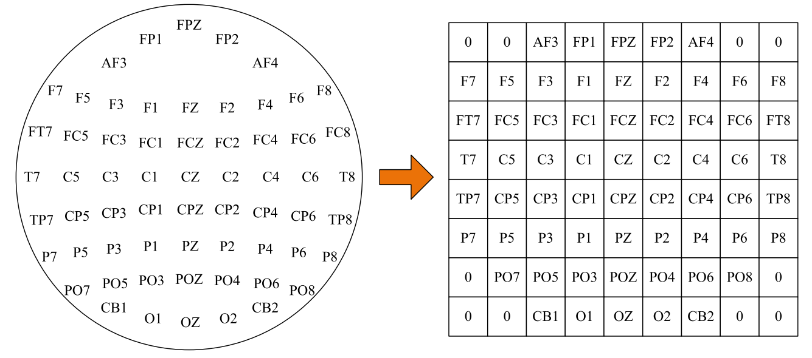
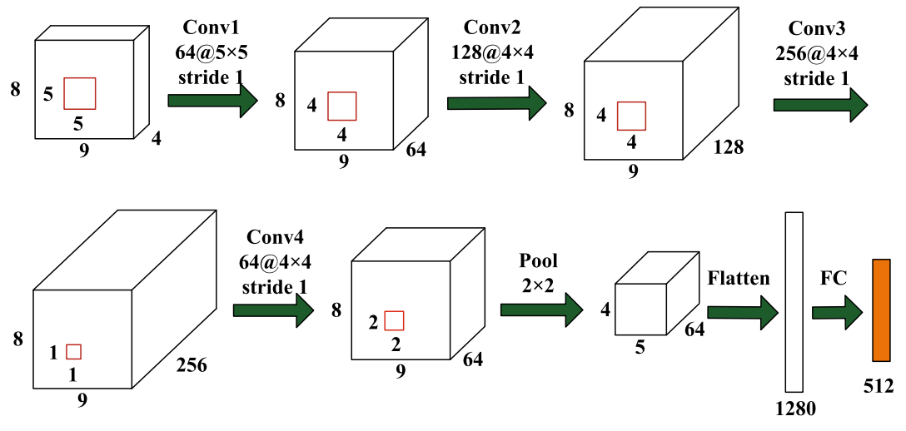

# Emotion Recognition with 4DRCNN and DGCNN

This repository records two implementations for emotion recognition, i. e., 4DRCNN and DGRCNN. The dataset is collected in a air combat confrontation game to investigate the relationships between physiological changes and their emotions (high or low emotional load). This repository can be modified easily according to the requirements of open datasets.

## Feature extraction

EEG is the source of this repository to be studied for emotion recognition. The dataset was splitted into multiple events and each event was splitted into windows (samples) with the sliding window method, i. e., the window length of 4 seconds and the step of 1 second. Then **differential entropy (DE)** features were extracted from each sample, get feature dimension of **(L, d, num_chan) for DGCNN_LSTM** where L is the number of sub-windows, d is the number of sub-bands. The last dim of features was expanded to (h, w) as follows, deriving 4-D of **(L, d, h, w) for 4DRCNN**.


The feature extraction implementations are located in ./utils/feature_extractor.py.

## Network architecture

#### [4DRCNN](https://link.springer.com/article/10.1007/s11571-020-09634-1)

4D features with the dim of (L, d, h, w) were fed into CNN frontend for spatial information extraction, and then through LSTM network to model temporal dependencies, finally mapped in to num_cls logits.


#### DGCNN with LSTM

3D features with dim of (L, d, num_chans) were fed into GCNN for spatial information modelling, then through LSTM network for temporal information modelling. The idea of building graph convolution with my personal understanding is summaried as follows:

1. Initialize adjacency matrix W;
2. Calculating Laplacian matrix L;
3. Generating Chebyshev polynomial items;
4. Calculating graph convolution results;

*However, the graph convolution of this explanation needs to be further considered after reading original DGCNN paper.*

## Code implementations

1. Generating dataset with `./datasets/create_dataset.py` (or re-code it)),
2. According to the use of 4DRCNN or DGCNN_LSTM model, navigate to ` ./datasets/ER_dataset.py` and modify normalized factors,

```
def normalize(data: torch.Tensor):
    # for 4DRCNN
    mu = torch.Tensor([2.6190, 2.1270, 2.1157, 2.2070, 1.8544]).view((1, 1, -1, 1, 1)).to(data.device)
    sig = torch.Tensor([1.2011, 0.9644, 1.0048, 1.2820, 1.3156]).view((1, 1, -1, 1, 1)).to(data.device)
    # for DGCNN_LSTM
    # mu = torch.Tensor([2.8943, 2.3537, 2.3500, 2.4557, 2.0621]).view((1, 1, -1, 1)).to(data.device)
    # sig = torch.Tensor([0.8648, 0.6804, 0.7376, 1.0630, 1.1718]).view((1, 1, -1, 1)).to(data.device)
    # breakpoint()
    return (data - mu) / sig
```

3. If 4DRCNN, navigate to `main.py` and run it;
4. if DGCNN_LSTM, navigate to `main_DGCNN_LSTM.py` and run it.
5. `./utils/plot_test_metrics.py` is used to plot test metrics along epoches.

## Results

Based on our private dataset and binary classification problems, 4DRCNN achieved ~80% accuracy, ~60% sensitivity and ~90% specificity; DGCNN_LSTM achieved ~84% accuracy, ~67% sensitivity and ~91% specificity.

## Reference

1. [Shen, Fangyao, et al. &#34;EEG-based emotion recognition using 4D convolutional recurrent neural network.&#34; Cognitive Neurodynamics 14.6 (2020): 815-828.](https://link.springer.com/article/10.1007/s11571-020-09634-1)
2. [Song, Tengfei, et al. &#34;EEG emotion recognition using dynamical graph convolutional neural networks.&#34; IEEE Transactions on Affective Computing 11.3 (2018): 532-541.](https://ieeexplore.ieee.org/abstract/document/8320798)
